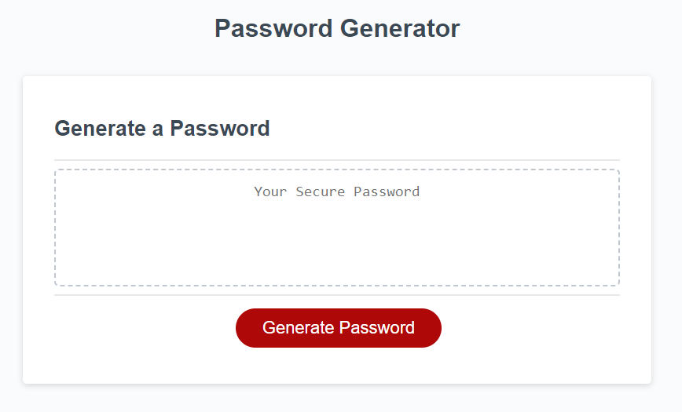

# js-password-gen

[Visit the Deployed Site](https://azurek17.github.io/js-password-gen/)

### Technoloy used:
* JavaScript - If...Else - https://www.w3schools.com/jsref/jsref_if.asp
* JavaScript - Logical Operators - https://www.w3schools.com/java/java_operators.asp
* JavaScript - For Loop - https://www.w3schools.com/java/java_for_loop.asp
* JavaScript - Math.random() - https://www.w3schools.com/jsref/jsref_random.asp

## Description

A random password generator. Starter code was provide to modify to prompts a user with options to generates a strong random password automatically.

## Usage

When you go to the website, you are prompt to "Generate Password".  They the user clicks the "Generate Password" the following occurs:

A dialog box pops up asking the user to pick a number between 8, and 128.  If the users pick a number less than 8 or over 128, and error pops up. When the user confirms, it loops to the start.  

This was complished by using Prompts, Alerts, If Else statements with comparision operaters, For loop, and Math.randon (to generate password).  

Below are a few examples of code:

-------------------------------------------------

### Prompt:

 javascript:

    var passwordLength = prompt( "message goes here");

--------------------------------------------------

### Alert, Confirm, If Else, & comparison operator, and calling the function to restart:

javascript:

    if (passwordLength < minLength || passwordLength > maxLength) { 
          alert("ERROR - Pick a number between  " + minLength + " - " + maxLength);
          generatePassword();
        }
        else {
        var lowerCase = confirm(" add text here");
        var upperCase = confirm("add text here");
        var numCase = confirm("add text here");
        var specialCase = confirm("add text here");
        }

---------------------------------------------------

### For Loop, Math.Random 

 javascript: 

    var charSel = ""; 
    var trueValue = [];

    if (lowerCase) {
      charSel = charSel.concat(lowerChar); console.log();
    }
    if (upperChar) {
      charSel = charSel.concat(upperChar); console.log();
    }
    
    for (var i =0; i < passwordLength; i++){
    trueValue.push(charSel[Math.floor(Math.random() * charSel.length)]);
    }
    password = trueValue.join ("");
    return password;

------------------------------------------------------

## Credits
* Stater code provided: https://github.com/coding-boot-camp/friendly-parakeet
* Tutoring Session: Andres Jimenez
* StudyGroup

----------------------------------------------------------------------------------
© 2023 github.com/AZurek17/js-password-gen Confidential and Proprietary. All Rights Reserved.
